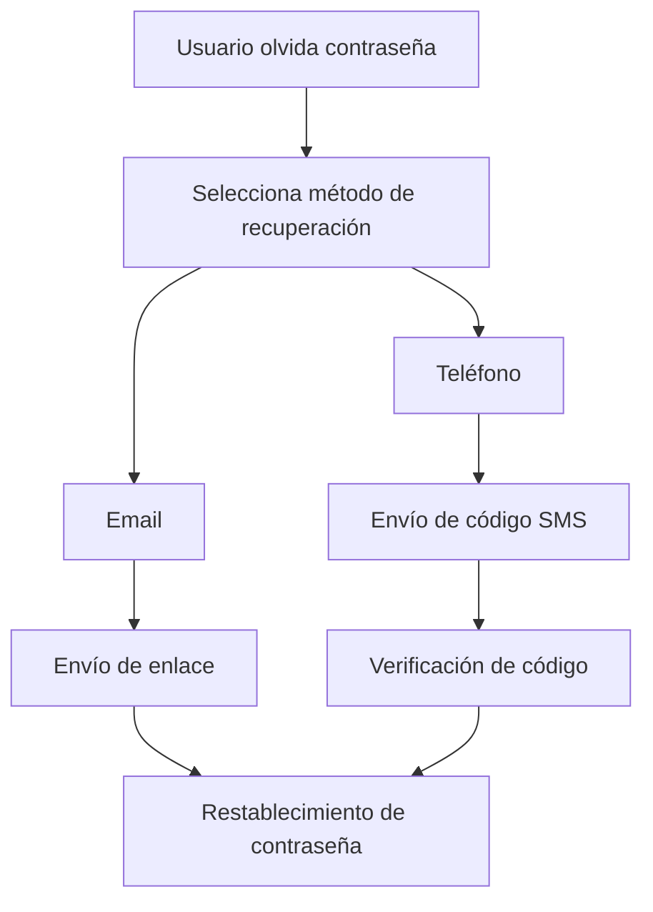

# OLEADA DE IMPLEMENTACIONES 3 - ABRIL 2025

## Mejora de la Experiencia Post-Autenticación

### Objetivos Alcanzados

1. **Visualización de Información del Usuario**
   - Implementación de componentes para mostrar datos del usuario autenticado
   - Creación de un sistema de perfil de usuario completo
   - Integración con Firestore para almacenamiento persistente de datos

2. **Mejora del Flujo de Navegación**
   - Implementación de un sistema de enrutamiento basado en el estado de autenticación
   - Creación de una experiencia fluida entre registro, verificación y uso de la aplicación
   - Manejo adecuado de diferentes estados de autenticación (verificación de email, error, etc.)

3. **Integración con Firebase Firestore**
   - Configuración de la base de datos en la nube para almacenar perfiles de usuario
   - Implementación de reglas de seguridad para proteger los datos
   - Creación de repositorios y modelos para gestionar la información

4. **Mejora de la Experiencia de Usuario en Autenticación**
   - Implementación de un sistema de notificaciones personalizado (CustomSnackBar)
   - Desarrollo de un sistema modular de recuperación de contraseña con múltiples métodos (email y SMS)
   - Adición de animaciones sutiles para mejorar la interactividad
   - Desarrollo de una página de bienvenida personalizada tras el primer inicio de sesión

### Detalles Técnicos

#### Modelo de Usuario

Se implementó un modelo de datos estructurado para la información del usuario:

```dart
class UserModel {
  final String uid;
  final String email;
  final String? displayName;
  final String? photoURL;
  final String? phoneNumber;
  final bool emailVerified;
  final DateTime? createdAt;
  final DateTime? updatedAt;
  final DateTime? lastLogin;

  // Métodos para convertir desde/hacia Firebase y Firestore
}
```

Este modelo permite:
- Almacenar información básica del usuario (nombre, email, foto)
- Registrar metadatos importantes (fechas de creación, actualización, último acceso)
- Facilitar la conversión entre diferentes fuentes de datos (Firebase Auth y Firestore)

#### Repositorio de Usuario

Se creó un repositorio dedicado para gestionar los datos del usuario:

```dart
class UserRepository implements UserRepositoryInterface {
  final FirebaseFirestore _firestore = FirebaseFirestore.instance;
  final FirebaseAuth _auth = FirebaseAuth.instance;

  // Métodos para obtener, guardar y actualizar datos del usuario
}
```

Este repositorio:
- Implementa una interfaz clara que define las operaciones disponibles
- Gestiona la comunicación con Firestore para almacenamiento persistente
- Maneja errores y casos extremos de forma robusta

#### Componentes de UI

1. **UserProfileCard**
   - Muestra la información del usuario (nombre, email, foto)
   - Proporciona acciones rápidas (editar perfil, cerrar sesión)
   - Indica el estado de verificación del email

2. **AppDrawer**
   - Menú lateral con opciones de navegación
   - Muestra información del usuario autenticado
   - Proporciona acceso a las principales funcionalidades

3. **AppRouter**
   - Gestiona la navegación basada en el estado de autenticación
   - Muestra diferentes pantallas según el estado (cargando, autenticado, no autenticado)
   - Maneja casos especiales como verificación de email

#### Integración con BLoC

Se mejoró el BLoC de autenticación para:
- Incluir el modelo de usuario en el estado
- Gestionar la persistencia de datos en Firestore
- Manejar diferentes estados de autenticación de forma más granular

```dart
class AuthBloc extends Bloc<AuthEvent, AuthState> {
  final AuthRepository _authRepository;
  final UserRepository _userRepository;
  // ...
}
```

#### Reglas de Seguridad de Firestore

Se implementaron reglas de seguridad para proteger los datos de los usuarios:

```
rules_version = '2';

service cloud.firestore {
  match /databases/{database}/documents {
    // Regla para la colección de usuarios
    match /users/{userId} {
      // Permitir lectura y escritura solo al propio usuario
      allow read, write: if request.auth != null && request.auth.uid == userId;
    }
    
    // Reglas para citas
    match /appointments/{appointmentId} {
      allow read, write: if request.auth != null && 
                          (resource == null || resource.data.userId == request.auth.uid);
    }
    
    // Reglas para servicios
    match /services/{serviceId} {
      allow read: if request.auth != null;
      allow write: if false; // Solo administradores
    }
    
    // Regla por defecto
    match /{document=**} {
      allow read, write: if false;
    }
  }
}
```

#### Sistema Modular de Recuperación de Contraseña

Se implementó un sistema modular y flexible para la recuperación de contraseñas, permitiendo múltiples métodos de recuperación:

1. **Arquitectura Modular**:
   - División en componentes reutilizables para mejorar mantenibilidad
   - Implementación de una estructura de archivos organizada por responsabilidades

```
lib/presentation/pages/
  ├── password_reset_page.dart           # Página principal
  └── password_reset/                    # Componentes modulares
      ├── email_recovery_form.dart       # Formulario para recuperación por email
      ├── phone_recovery_form.dart       # Formulario para recuperación por teléfono
      └── success_message.dart           # Mensaje de éxito personalizado
```

2. **Métodos de Recuperación**:
   - **Email**: Envío de enlace para restablecer contraseña a través de Firebase Auth (completamente funcional)
   - **SMS**: Interfaz preparada para envío de códigos de verificación (requiere configuración adicional)

3. **Experiencia de Usuario Mejorada**:
   - Selector intuitivo de método de recuperación (segmentado)
   - Animaciones de transición entre estados
   - Mensajes de éxito personalizados según el método seleccionado
   - Validación en tiempo real de entradas de usuario

4. **Integración con Firebase**:
   - Utilización de `sendPasswordResetEmail` de Firebase Auth para recuperación por email
   - Código preparado para integración con `verifyPhoneNumber` de Firebase Auth
   - **Requisitos para SMS**: 
     - Plan de facturación Blaze en Firebase
     - Habilitación de autenticación por teléfono en Firebase Console
     - Configuración de reCAPTCHA para verificación web

5. **Arquitectura Modular**:



1. **Interfaz de Usuario**:
   - Formulario modular con selección de método (email/teléfono)
   - Validación de entradas en tiempo real
   - Animaciones y transiciones para mejorar la experiencia

2. **Métodos de Recuperación**:
   - **Email**: Envío de enlace para restablecer contraseña a través de Firebase Auth (completamente funcional)
   - **SMS**: Interfaz preparada para envío de códigos de verificación (requiere configuración adicional)

3. **Experiencia de Usuario Mejorada**:
   - Selector intuitivo de método de recuperación (segmentado)
   - Mensajes de confirmación claros y detallados
   - Validación en tiempo real de entradas de usuario

4. **Integración con Firebase**:
   - Utilización de `sendPasswordResetEmail` de Firebase Auth para recuperación por email
   - Código preparado para integración con `verifyPhoneNumber` de Firebase Auth

5. **Arquitectura Modular**:
   - Separación de responsabilidades en componentes especializados:
     - `PasswordResetService`: Encapsula la lógica de autenticación con Firebase
     - `EmailRecoveryForm`: Maneja la entrada del correo electrónico
     - `PhoneRecoveryForm`: Maneja la entrada del número de teléfono
     - `VerificationCodeForm`: Maneja la entrada del código de verificación
     - `SuccessMessage`: Muestra mensajes de éxito personalizados
     - `ResetForm`: Integra los formularios y la lógica de selección de método
   - Beneficios de la modularización:
     - Mayor legibilidad y mantenibilidad del código
     - Facilidad para implementar pruebas unitarias
     - Reutilización de componentes en otras partes de la aplicación

### Problemas Encontrados y Soluciones

1. **API de Firestore no habilitada**
   - **Problema**: El registro funcionaba pero no se guardaban los datos en Firestore
   - **Solución**: Habilitación de la API de Firestore en la consola de Google Cloud
   - **Aprendizaje**: Verificar que todas las APIs necesarias estén habilitadas antes de implementar funcionalidades

2. **Manejo de estados de autenticación**
   - **Problema**: Dificultad para gestionar diferentes estados (email verificado, no verificado, etc.)
   - **Solución**: Implementación de un sistema de estados más granular en el BLoC
   - **Aprendizaje**: Diseñar estados que cubran todos los casos posibles desde el principio

3. **Redirección a página de bienvenida**
   - **Problema**: Navegación incorrecta después de la autenticación exitosa
   - **Solución**: Permitir que el AppRouter maneje la navegación basada en el estado de autenticación
   - **Aprendizaje**: Centralizar la lógica de navegación para evitar conflictos

4. **Recuperación de contraseña no funcionaba**
   - **Problema**: El botón "Olvidé mi contraseña" no realizaba ninguna acción
   - **Solución**: Implementación de un sistema modular con múltiples métodos de recuperación
   - **Aprendizaje**: Diseñar flujos de usuario completos y probarlos exhaustivamente
   - **Nota**: La recuperación por SMS requiere configuración adicional en Firebase (plan Blaze)
   - **Mejora adicional**: Refactorización completa del código para seguir principios SOLID

5. **Navegación después de la autenticación**
   - **Problema**: Experiencia inconsistente después del inicio de sesión o registro
   - **Solución**: Creación de un router centralizado que maneja la navegación basada en el estado
   - **Aprendizaje**: Centralizar la lógica de navegación para mantener consistencia

4. **Redirección a página de bienvenida**
   - **Problema**: El SnackBar de inicio de sesión exitoso aparecía pero no redirigía a la página de bienvenida
   - **Solución**: Modificación de los modales de inicio de sesión y registro para navegar a la ruta principal después de cerrar el modal
   - **Aprendizaje**: Asegurar que los componentes de UI permitan que el router maneje la navegación basada en el estado

---

*Documentación actualizada: 20 de abril de 2025 (18:28)*